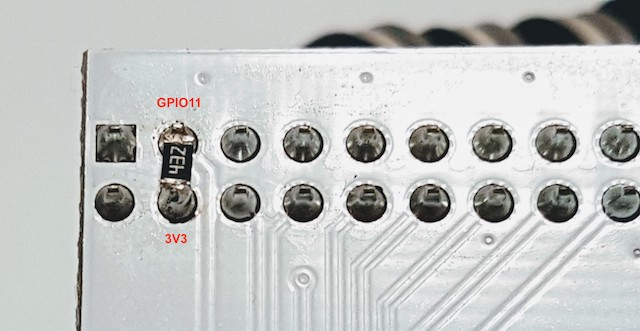

# Project:  SRTM
# What is it?  Server Room Temperature Monitor
The project goal is monitor the temperature in a IT Room where the Server machines are running.
Provide email alerts if the temperature is greater than a certain setpoint.  Furthermore, it is desired to send on 
regular scheduled "info" emails with the current temperature based on intervals (hours).

##### Time required:  2hs.  Level: beginners

## Hardware
- Onion Omega2: OM-O2
- Arduino Dock 2 
- Temperature Sensor: DS1820


## Firmware
Ω-ware: 0.1.10 b160

## Libs/versions
- BusyBox v1.26.2 () built-in shell (ash)
- Python Light
- Python pip

# Connecting the temperature sensor


Detail of the PINS involved:  GPIO 11, 3V3 and GND.


Pull-up resistor detail on the bottom side:




# Configuring the Program 

The settings are inside tempMonitor.py :

```python
# setup onewire and polling interval
oneWireGpio = 11 # set the sensor GPIO
pollingInterval = 60 # seconds
infoInterval = 8  # hours
```
- `pollingInterval`: sensor update, each 60 seconds the temperature will be compared with the setpoint.
- `infoInterval`: number of hours between INFO emails.

```python
# setup Temp
setPoint = 22  # Celsius
```
- `setPoint`: if the temperature rises above this value an ALERT email will be triggered.

```python
# e-mail settings - change these values with your provider 
sender = 'sender@email'
toaddrs = 'recpient@email'
# Credentials
password = 'xxxxxxxx'
```
- `sender`: sender email address
- `toaddrs`: recipient email address
- `password`: sender account password

Change your email smtp server based on your service:
```python
server = smtplib.SMTP_SSL('smtp.gmail.com:465') # smtp server
```

# Deployment
## Install python
```console
opkg update
```

Now you can install python-light:

```console
opkg install python-light
```
### Using `pip` to Install Python Modules

The official Python package manager, `pip`, is the standard way of installing Python modules on a system. You will get a large selection of available packages from which to choose.

#### Installing `pip`

We'll need to first install `pip` on the Omega:

```console
opkg update
opkg install python-pip
```
####  Copy the project files inside a folder
```console
root@Omega-xxxx:~# ls
oneWire.py            tempMonitor.py        temperatureSensor.py
root@Omega-xxxx:~#
```
#### Editing the /etc/rc.local File

The /etc/rc.local file is a script that will be executed automatically by the system once the boot sequence is complete.

When your Omega boots, it will read commands from the /etc/rc.local file, and execute them.
```bash
# Put your custom commands here that should be executed once
# the system init finished. By default this file does nothing.
python  /root/tempMonitor.py &  
exit 0
```
Note: If your command runs continuously and never reaches the exit 0 line in the /etc/rc.local file, 
then your Omega will not successfully finish it’s boot sequence. To avoid this scenario, make sure you fork the process 
by adding an ampersand to the end of the command.

### Sample Alert Email from the SRTM
```console
Date: Sat, 13 Jan 2018 23:24:41 -0800 (PST)
From: sender@email.com
To: recipient@email.com
Subject: Server Room Temp [ALERT]

2018-01-13 23:24:40 T = 22.125[C] 71.825[F]
```

## References:
Reading a 1-Wire Temperature Sensor
- https://docs.onion.io/omega2-starter-kit/starter-kit-temp-sensor.html

Reading 1-Wire Sensor Data with the Omega
- https://wiki.onion.io/Tutorials/Reading-1Wire-Sensor-Data

Arduino Dock 2
- https://docs.onion.io/omega2-docs/arduino-dock-2.html

Sending Emails With the Omega using Python
- https://wiki.onion.io/Tutorials/Sending-Emails-With-Python

Installing and Using Python
- https://github.com/OnionIoT/Onion-Docs/blob/master/Omega2/Documentation/Doing-Stuff/Installing-Software/Installing-and-Using-Python.md

Running a Command on Boot
- https://docs.onion.io/omega2-docs/running-a-command-on-boot.html

(C) 2018,  Hernan Monserrat, License GNU GPL 3<br>
Onion, onion.io, Omega 2 are (C) Onion Corporation, more details: http://onion.io

